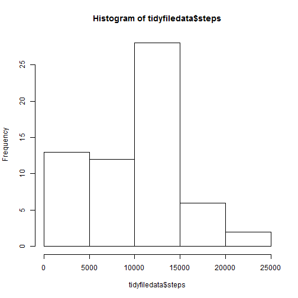
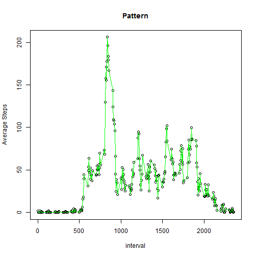
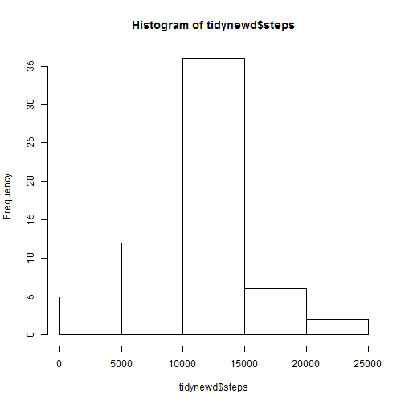
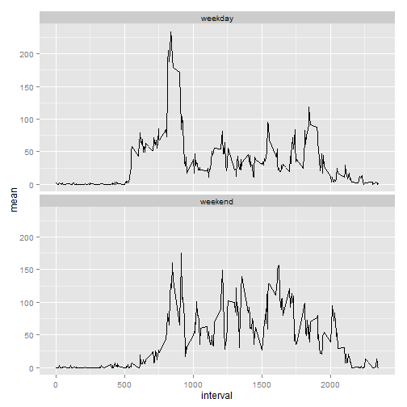

#Reproducible research Peer Assesment 1 by Anurag
=====================================================

## Loading and preprocessing the data
To answer questions asked in this excercise we will first read the file and extract dates and corresponding steps.

```r
filepath<-"C:\\ANURAG B\\Work\\Analytics\\Coursera\\repdata_data_activity\\activity.csv"
origfiledata<-read.csv(filepath,header=TRUE)
format(origfiledata$date<-as.Date(origfiledata$date, "%Y-%m-%d"))
```

## What is mean total number of steps taken per day?
We will use function aggregate to aggregate the data by date and then we will use function mean to calculate the mean.

```r
filedata<-transform(origfiledata, date=as.factor(date))
tidyfiledata<-with(filedata,aggregate(steps,by=list(date),FUN="sum", na.rm=T))
colnames(tidyfiledata)<-c("date","steps")
hist(tidyfiledata$steps)
```

 

```r
mean(tidyfiledata$steps)
```

```
## [1] 9354.23
```

```r
median(tidyfiledata$steps)
```

```
## [1] 10395
```

## What is the average daily activity pattern?
We will plot the steps vs date to look at the pattern

```r
tidyfiledata.mean<-with(filedata,aggregate(steps,by=list(interval),FUN="mean", na.rm=T))
colnames(tidyfiledata.mean)<-c("interval","avg.steps")
with(tidyfiledata.mean,plot(interval,avg.steps,xlab= "interval",ylab="Average Steps",main="Pattern"))
with(tidyfiledata.mean,lines(interval,avg.steps,col="green"))
```

 
Looking at the graph we can say that average daily pattern keeps fulctuating.

The inteval with max no. of steps

```r
tidyfiledata.mean$interval[which.max(tidyfiledata.mean$avg.steps)] 
```

```
## [1] 835
```

## Imputing missing values
1. Calculate total no. of NAs in steps


```r
length(which(is.na(filedata$steps)))
```

```
## [1] 2304
```

2 & 3. Fill NAs with followin stragege  
Repalce blanks with mean of all steps excluding NAs


```r
newd<-filedata
newd$steps[is.na(newd$steps)]<- mean(filedata$steps, na.rm=T)
```
4.  New Mean and median with filled data and the histogram


```r
tidynewd<-with(newd,aggregate(steps,by=list(date),FUN="sum", na.rm=T))
colnames(tidynewd)<-c("date","steps")
hist(tidynewd$steps)
```

 

```r
mean(tidynewd$steps)
```

```
## [1] 10766.19
```

```r
median(tidynewd$steps)
```

```
## [1] 10766.19
```
Slight increase in Mean and median
## Are there differences in activity patterns between weekdays and weekends?

```r
origfiledata$day[weekdays(origfiledata$date) %in% c("Saturday","Sunday")] <- "weekend"
origfiledata$day[!weekdays(origfiledata$date) %in% c("Saturday","Sunday")] <- "weekday"
origfiledata<-transform(origfiledata, day=as.factor(day))

stepsmean<-with(origfiledata,aggregate(steps,by=list(interval,day),FUN="mean", na.rm=T))
colnames(stepsmean) <-c("interval","day","mean")
library(ggplot2)
ggplot(stepsmean, aes(x=interval, y=mean)) + geom_line() + facet_wrap(~ day, ncol=1)
```

 


